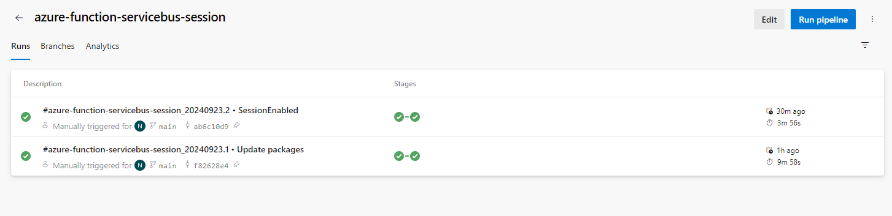
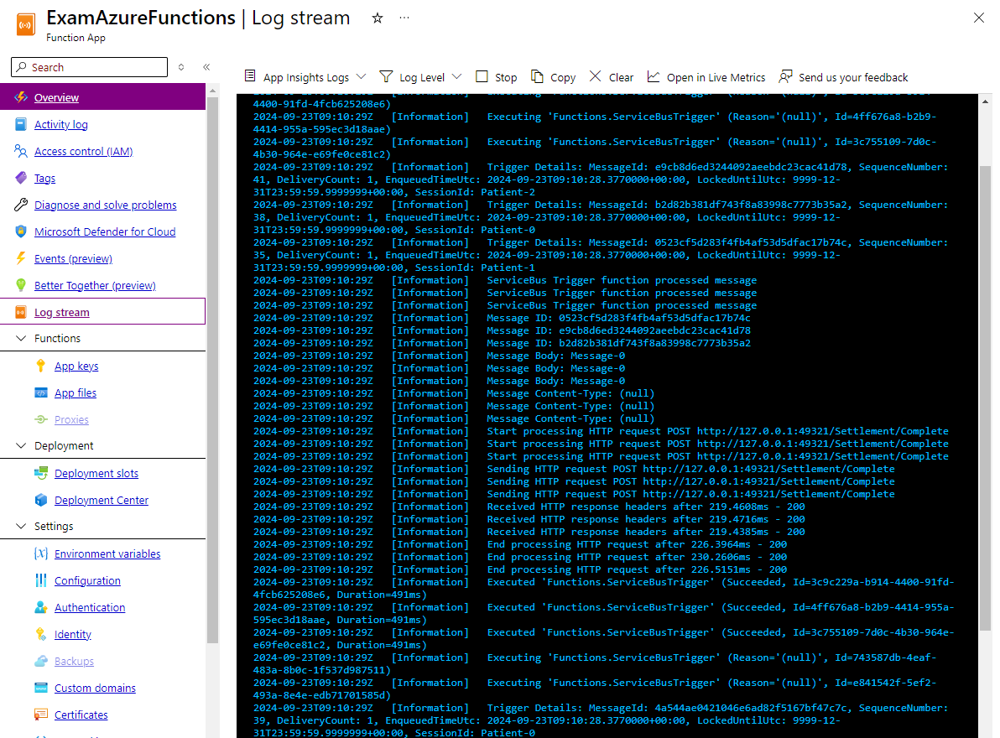

# Example Azure Function With Service Bus Trigger
+ Create Azure Function in Azure Portal
+ Create Azure Service Bus and add queue `myqueue` in Azure Portal
+ Add `ServiceBus` or `AzureWebJobsServiceBus` into App settings tab in Environment variables of Azure Function
+ Deploy zip package via Azure DevOps
+ Using ServiceBusSenderMessages for sending messages

### Result
+ Azure Pipeline

+ Incoming messages and outgoing messages

+ Log

