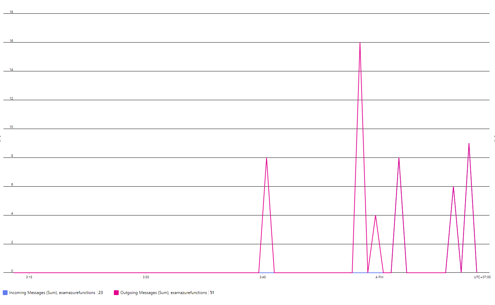

# Example Azure Function With Service Bus Trigger
+ Example Azure Function with Service Bus Trigger and deployment via Azure DevOps

## Requisites
+ Create Azure Service Bus and add queue `myqueue` in Azure Portal
+ Create Storage Account Name and Container Name for Terraform State file

## Deploy Azure Function
+ Create Azure Function in Azure Portal
+ Add `ServiceBus` or `AzureWebJobsServiceBus` into App settings tab in Environment variables of Azure Function
+ Deploy zip package via Azure DevOps (azure-pipelines.yml)
+ Using ServiceBusSenderMessages for sending messages

### Results
+ Azure Pipeline

+ Incoming messages and outgoing messages

+ Log

## Deploy Infrastructure Azure Function with Terraform
+ Create Infrastructure with Terraform
+ Deploy Azure Function and Add AppSetting Values (deployment.yml)
+ Using ServiceBusSenderMessages for sending messages

### Results
+ Azure Pipeline Deployment

+ AppSetting in Azure Function

